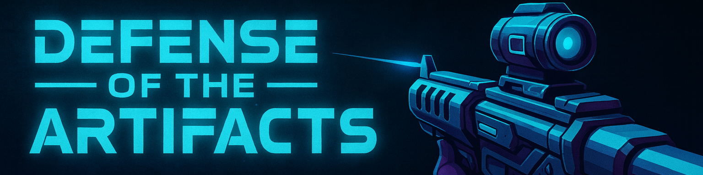

# 

# **Defense of the Artifacts**
A lightweight **web-based multiplayer first-person shooter** built using **Babylon.js, Socket.IO, and Node.js**.  
Players can join directly through the browser, no installation required and battle in real-time inside a 3D arena.
This project is designed as a final project for a software engineering course.

## ⚙️ **Tech Stack**
Babylon.js – 3D rendering

Socket.IO – real-time multiplayer

Node.js – server-side game logic

Vite + TypeScript – fast client development environment

## 🔥**Project Status**

 Repository created ✅

 Client scaffold with Vite + TypeScript ✅

 Server scaffold with Node.js + Socket.IO ✅

 Client <-> Server socket connection working ✅

 Add Babylon.js 3D scene

 Implement movement + camera

 Implement player synchronization

 Implement combat system

 Implement HUD + UI

 Add PvP mode

 Add deployment